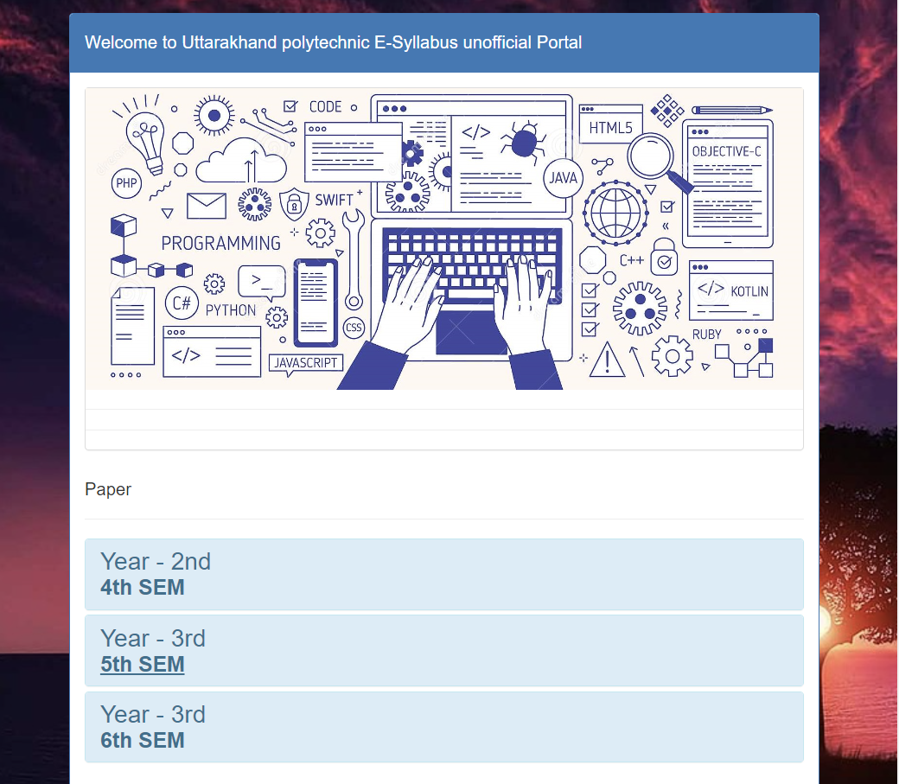

# UBTER CSE Engineering Syllabus Website

This repository contains a website that provides an unofficial syllabus portal for UBTER CSE Engineering course. The website is designed to help students access and navigate through the syllabus for various semesters and subjects.



## Features

- Organized syllabus for different semesters and subjects.
- Accordion-style UI for easy navigation and content expansion.
- Download links for syllabus documents.
- Responsive design for seamless viewing on various devices.

## Usage

1. Clone the repository:

```bash
git clone https://github.com/Sandeep-Petwal/syllabus.github.io.git
```
2. Copy live URL :
```bash
https://sandeep-petwal.github.io/syllabus.github.io/index.html
```
# Live Demo
Check out the live website at GitHub Pages: https://sandeep-petwal.github.io/syllabus.github.io/index.html

# Contributing
Contributions are welcome! If you find any issues or want to add new features, feel free to submit a pull request.

Contact
For any questions or inquiries, please contact:

Sandeep Prasad

Email: sandeeppetwal51@gmail.com

GitHub: Sandeep-Petwal
